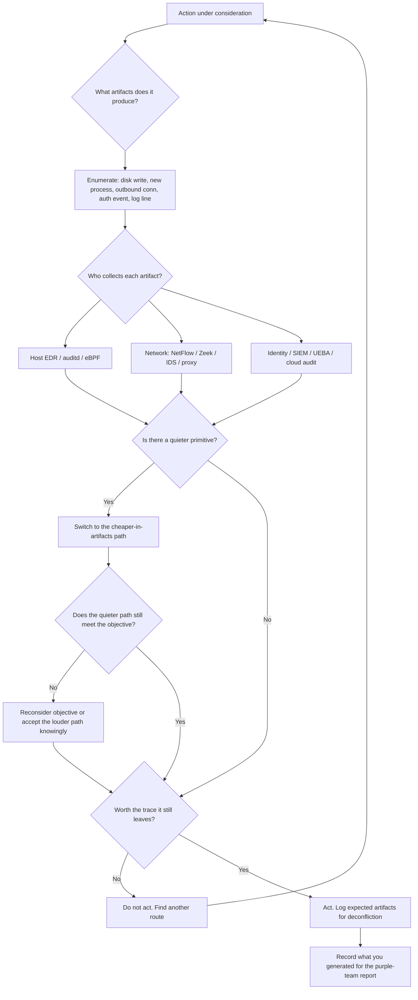
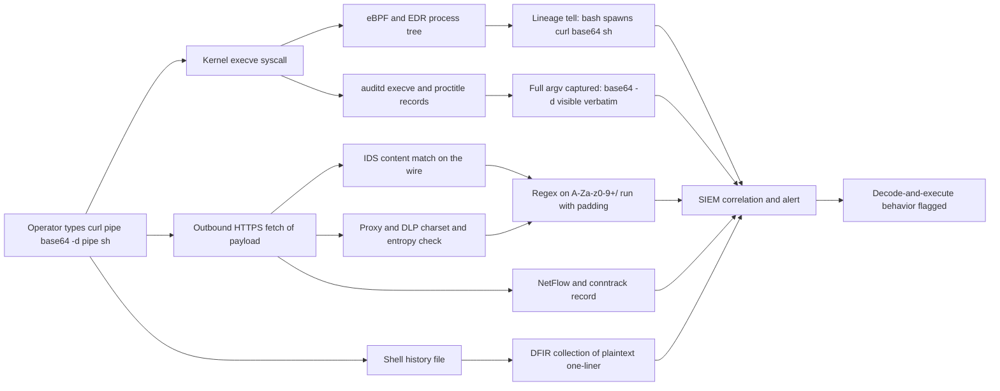

<div align="center">

# Quiet Operator

**A purple-team field manual for staying stealthy on the host and on the wire.**

Tradecraft for *authorized* red team operations, paired page-for-page with the
**detection telemetry** defenders use to catch it.

<br>


<br>

*Linux first. Then data transfer / exfiltration. Then Windows. Then C2 infrastructure.*
*Every offensive page ends with the artifacts it leaves behind.*

</div>

---

> [!CAUTION]
> **Authorized engagements only.** Read [`DISCLAIMER.md`](DISCLAIMER.md) before anything
> else. Use this material only with signed scope (ROE/SOW), in your own lab, or in a CTF.
> Unauthorized access, interception, and exfiltration are crimes. Every offensive page
> here ships with a **Detection & telemetry** section written *for the blue team* - that
> pairing is the point.

---

## Table of contents

- [The thesis: stealth is telemetry management](#the-thesis-stealth-is-telemetry-management)
- [Who this is for](#who-this-is-for)
- [Visual overview](#visual-overview)
- [Quick start](#quick-start)
- [The map](#the-map)
  - [0. Foundations](#0-foundations--read-first)
  - [1. Linux (deepest)](#1-linux-deepest)
  - [2. Data transfer / exfiltration](#2-data-transfer--exfiltration)
  - [3. Windows](#3-windows)
  - [4. C2 infrastructure OPSEC](#4-c2-infrastructure-opsec)
  - [5. Defender's cross-mapping](#5-defenders-cross-mapping)
  - [References](#references)
- [The artifact-cost idea in one table](#the-artifact-cost-idea-in-one-table)
- [The base64 lesson](#the-base64-lesson-encoding-is-not-hiding)
- [How the repo is structured](#how-the-repo-is-structured)
- [Contributing](#contributing)
- [License](#license)

---

## The thesis: stealth is telemetry management

Most "evasion" notes teach you to *do* a thing without teaching you what the thing
*leaves behind*. An operator who does not know which log line, syscall, or event ID
their command produced is not stealthy - they are lucky.

This manual treats stealth as **telemetry management**. Every action has a cost paid in
artifacts: a disk write, a spawned process, an outbound connection, an auth event, a log
line. Good tradecraft is choosing the **cheapest path in artifacts** that still gets the
job done - and knowing exactly who is collecting each one. Defenders get the same pages
and learn precisely where to look. Offense and defense ship together here on purpose.

Three rules the whole repo is built on:

1. **Avoid generating the artifact - do not try to delete it.** In a world of central
   SIEM and log forwarding, local deletion is near-useless and is itself a screaming IOC.
2. **Native and expected beats novel and dropped** - but command-line and behavioral
   telemetry still capture you. Living off the land defeats AV signatures, not EDR lineage.
3. **Regularity and volume are the meta-tells.** Fixed intervals and fixed sizes get you
   caught long after the payload was "undetectable." Encoding does not fix this; it usually
   makes it worse.

## Who this is for

| You are... | Start here | You get |
|---|---|---|
| A **red team operator** on an authorized engagement | [Foundations](docs/00-foundations/operator-opsec-model.md) then your target OS | The quiet variant of each technique and your blast radius in artifacts |
| A **blue teamer / detection engineer** | [`detection-mapping/`](docs/detection-mapping/blue-team-view-and-attack-mapping.md) | The exact log source, event ID, and hunt query for each technique |
| A **purple team** running a joint exercise | [Threat model & telemetry](docs/00-foundations/threat-model-and-telemetry.md) | A shared vocabulary for "what does this look like to the SOC" |

## Visual overview

Two charts capture the whole thesis. The full set is in [`docs/diagrams.md`](docs/diagrams.md):
the operator decision loop, the exfil channel decision tree, the base64 decode-and-execute
telemetry data-flow, a noise-vs-value technique quadrant, the defender telemetry mind-map,
and the kill chain annotated with the loudest signal at each stage.

**Operator decision loop** - run this before every action. Spend artifacts deliberately, not by accident.



**Base64 decode-and-execute data flow** - encoding raises signal, it does not lower it. Every stage is a place a defender already watches.



## Quick start

```text
1. Read DISCLAIMER.md and confirm you have written authorization in scope.
2. Read docs/00-foundations/ - the OPSEC model, ROE, and the defender threat model.
3. Open the page for your task. Read it bottom-up:
   - "Detection & telemetry" first  -> know what you are about to generate.
   - "OPSEC notes"                   -> pick the quiet variant.
   - "Technique"                     -> the how.
4. Cross-check docs/detection-mapping/ to see how a SOC would catch you.
```

## The map

### 0. Foundations - read first
| Page | Covers |
|------|--------|
| [Operator OPSEC model](docs/00-foundations/operator-opsec-model.md) | Artifact budgeting, the noise/value trade, kill-chain discipline |
| [Authorization & ROE](docs/00-foundations/authorization-and-roe.md) | Scope, deconfliction, data handling, stop conditions |
| [Threat model & telemetry](docs/00-foundations/threat-model-and-telemetry.md) | What the modern defender actually collects: EDR, eBPF, Sysmon, SIEM |

### 1. Linux (deepest)
| Page | Covers |
|------|--------|
| [Host triage & situational awareness](docs/linux/01-host-triage-and-situational-awareness.md) | Reading the environment quietly before you touch it |
| [Process stealth & masquerading](docs/linux/02-process-stealth-and-masquerading.md) | argv/comm spoofing, memfd, fileless exec, hiding from `ps` |
| [Persistence stealth](docs/linux/03-persistence-stealth.md) | systemd, cron, udev, PAM, LD_PRELOAD - and their footprints |
| [Log & anti-forensics](docs/linux/04-log-and-anti-forensics.md) | auth.log, utmp/wtmp/btmp, journald, history, timestomping |
| [Living off the land](docs/linux/05-living-off-the-land.md) | GTFOBins, native interpreters, avoiding dropped binaries |
| [Network stealth & tunneling](docs/linux/06-network-stealth-and-tunneling.md) | Egress selection, SSH/proxy tunnels, traffic blending, timing |
| [EDR & kernel telemetry evasion](docs/linux/07-edr-and-kernel-telemetry-evasion.md) | auditd, eBPF, ptrace, syscall awareness, what is and is not hookable |
| [Credential access & lateral movement](docs/linux/08-credential-access-and-lateral-movement.md) | SSH agent/keys, quiet pivoting, avoiding lockouts and alerts |

### 2. Data transfer / exfiltration
| Page | Covers |
|------|--------|
| [Exfil principles & staging](docs/data-transfer/01-exfil-principles-and-staging.md) | What to take, chunking, throttling, when to move |
| [Encoding, compression & encryption](docs/data-transfer/02-encoding-compression-encryption.md) | **base64 / encoding telemetry**, compress-then-encrypt, splitting |
| [DNS tunneling](docs/data-transfer/03-dns-tunneling.md) | Low-and-slow DNS exfil and how resolvers log it |
| [HTTPS & cloud exfil](docs/data-transfer/04-https-and-cloud-exfil.md) | Blending into SaaS/cloud egress, webhooks, object storage |
| [Covert channels](docs/data-transfer/05-covert-channels.md) | ICMP, timing channels, steganography |
| [Out-of-band & throttling](docs/data-transfer/06-out-of-band-and-throttling.md) | Rate shaping, jitter, off-hours, alternate media |

### 3. Windows
| Page | Covers |
|------|--------|
| [Process stealth](docs/windows/01-process-stealth.md) | PPID spoofing, masquerading, command-line logging awareness |
| [Persistence stealth](docs/windows/02-persistence-stealth.md) | Run keys, tasks, services, WMI, COM - with their event trails |
| [Log & anti-forensics](docs/windows/03-log-and-anti-forensics.md) | Security/PowerShell/Sysmon logs, ETW, what clearing costs you |
| [LOLBAS & execution](docs/windows/04-lolbas-and-execution.md) | Signed-binary proxy execution and the telemetry it still emits |
| [EDR evasion: AMSI & ETW](docs/windows/05-edr-evasion-amsi-etw.md) | AMSI/ETW concepts, script-block logging, defensive blind spots |

### 4. C2 infrastructure OPSEC
| Page | Covers |
|------|--------|
| [Redirectors & domain fronting](docs/c2-infrastructure/01-redirectors-and-domain-fronting.md) | Hiding the team server, categorization, TLS |
| [Malleable profiles & jitter](docs/c2-infrastructure/02-malleable-profiles-and-jitter.md) | Shaping beacon traffic: sleep, jitter, indicators |
| [Infrastructure segregation & OPSEC](docs/c2-infrastructure/03-infrastructure-segregation-and-opsec.md) | Tiering, burn procedures, attribution hygiene |

### 5. Defender's cross-mapping
| Page | Covers |
|------|--------|
| [Blue-team view & ATT&CK mapping](docs/detection-mapping/blue-team-view-and-attack-mapping.md) | Every technique here, mapped to detections |
| [base64 & encoding telemetry](docs/detection-mapping/base64-and-encoding-telemetry.md) | **Exactly what is logged when you encode/decode to move data** |

### References
| Page | Covers |
|------|--------|
| [Diagrams](docs/diagrams.md) | The full set of Mermaid charts |
| [Tooling index](docs/references/tooling-index.md) | Native + open-source tooling, with OPSEC ratings |
| [MITRE ATT&CK crosswalk](docs/references/mitre-attack-crosswalk.md) | Technique-ID table for the whole repo |

## The artifact-cost idea in one table

A condensed preview of the model. The full reasoning is in
[the OPSEC model page](docs/00-foundations/operator-opsec-model.md).

| Action | Typical artifacts | Who collects it |
|---|---|---|
| Run a command | `auditd` execve, shell history, EDR process event (full argv) | Host EDR, auditd, SIEM |
| Spawn a shell from a utility | Anomalous parent-child lineage | EDR, Sysmon/Falco |
| New outbound connection | NetFlow/IPFIX record, conntrack, possibly DNS + proxy log | NSM, firewall, proxy |
| `sudo -l` / failed auth | `auth.log`/`secure`, btmp, UEBA signal | SIEM, IdP |
| Read `id_rsa` / `credentials` | File-access event (auditd watch / EDR) | EDR, FIM |
| New persistence (cron/systemd/Run key/task) | File create + service/task/registry event | FIM, Sysmon, autoruns |
| `base64 -d \| sh` | Process tree + decoded content in logs + on-wire pattern | EDR, IDS, DLP |
| Clear a log | The clear event itself (Linux config-change / Win 1102) | SIEM (already forwarded) |
| Large/odd outbound volume | NetFlow volume anomaly, DLP content match | NSM, DLP, UEBA |

## The base64 lesson: encoding is not hiding

Operators reach for `base64` constantly - to move binary over text channels, to fit data
into DNS labels or JSON, to copy-paste blobs. It is worth being blunt about what it costs,
because this repo treats it as a worked example of the whole thesis:

- **It is encoding, not encryption.** Any analyst decodes it instantly. It hides nothing.
- **It raises signal, it does not lower it.** It inflates size ~33%, produces a
  recognizable `[A-Za-z0-9+/]+=*` charset, and bumps string entropy - all of which DLP,
  IDS, and entropy analytics key on.
- **The command line is logged in full.** `cat secrets.tar | base64 | curl ...` records a
  `base64` child process with its parent and arguments in `auditd` execve and EDR. Shell
  history keeps it too.
- **`... | base64 -d | sh` is one of the most heavily signatured patterns in existence.**
  Sigma, Falco, and EDR all flag decode-and-execute. On Windows, `certutil -decode` and
  PowerShell `-EncodedCommand` are the direct equivalents - and Script Block Logging
  (event **4104**) records the *decoded* content.
- **On the wire, long base64 strings** in HTTP bodies, URLs, headers, cookies, and DNS
  labels are matched by Suricata/Snort content rules and proxy DLP.

The genuinely quieter move is real encryption to opaque bytes sent *inside an already-
encrypted, expected channel* - but even then the entropy, volume, and TLS metadata tells
remain. Full treatment:
[**data-transfer/02**](docs/data-transfer/02-encoding-compression-encryption.md) and the
dedicated deep-dive
[**detection-mapping/base64-and-encoding-telemetry**](docs/detection-mapping/base64-and-encoding-telemetry.md).

## How the repo is structured

```text
quiet-operator/
├── README.md                     <- you are here
├── DISCLAIMER.md                 <- authorized-use terms (read first)
├── CONTRIBUTING.md               <- the page contract every doc follows
├── LICENSE                       <- MIT
└── docs/
    ├── 00-foundations/           <- OPSEC model, ROE, defender threat model
    ├── linux/                    <- 8 pages, deepest coverage
    ├── data-transfer/            <- 6 pages, exfil tradecraft + telemetry
    ├── windows/                  <- 5 pages
    ├── c2-infrastructure/        <- 3 pages, infra OPSEC
    ├── detection-mapping/        <- blue-team index + base64 deep-dive
    ├── references/               <- tooling index + ATT&CK crosswalk
    └── diagrams.md               <- all Mermaid charts
```

Every page follows the same contract (see [`CONTRIBUTING.md`](CONTRIBUTING.md)):
**What & why -> Technique -> OPSEC notes -> Detection & telemetry -> MITRE ATT&CK ->
References.** A page with a weak detection section does not get merged.

## Want to practice this on real boxes?

Apply these techniques against HackTheBox machines - a controlled, legal environment with
real operating systems and real defenses.

**[HTB writeups by the author - momenbasel.github.io/htb-writeups](https://momenbasel.github.io/htb-writeups/)**

Each writeup documents the full attack path including the telemetry the technique would have
generated - a practical companion to the theory in this repo.

## Contributing

PRs welcome from operators and defenders. Keep examples to lab/RFC-5737 documentation IPs
and `example.com` - no live targets, no real loot. Pair every offensive note with its
detection. See [`CONTRIBUTING.md`](CONTRIBUTING.md).

## License

[MIT](LICENSE). Educational and authorized-testing use only. See [`DISCLAIMER.md`](DISCLAIMER.md).
