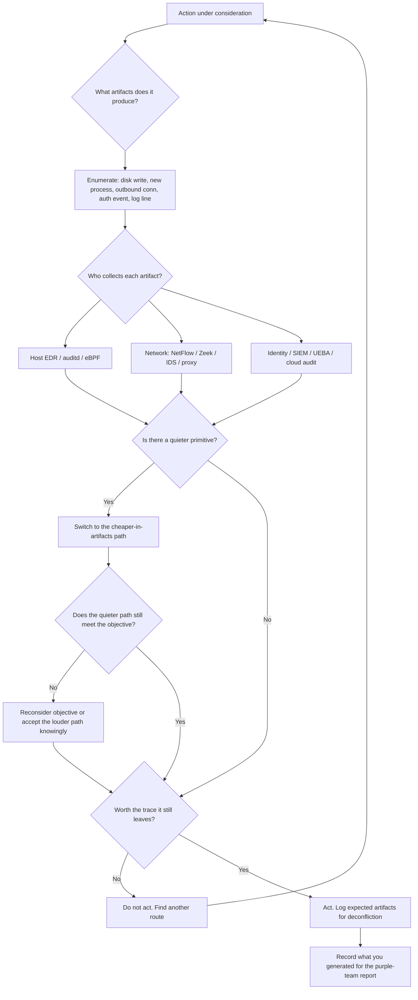
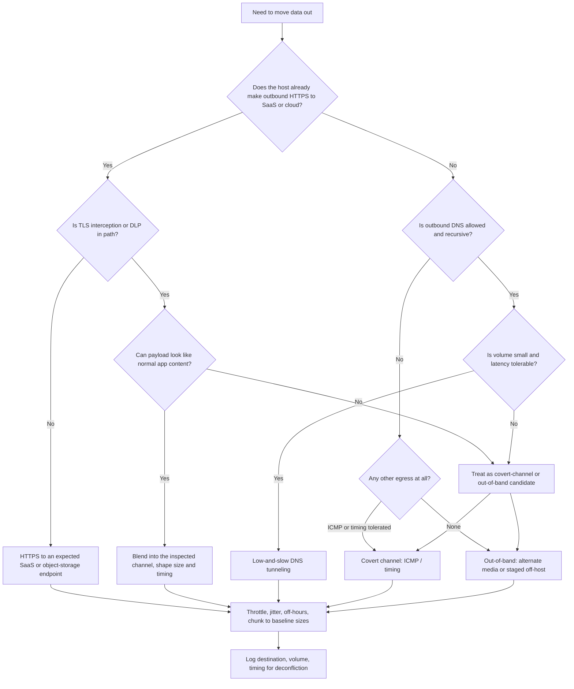
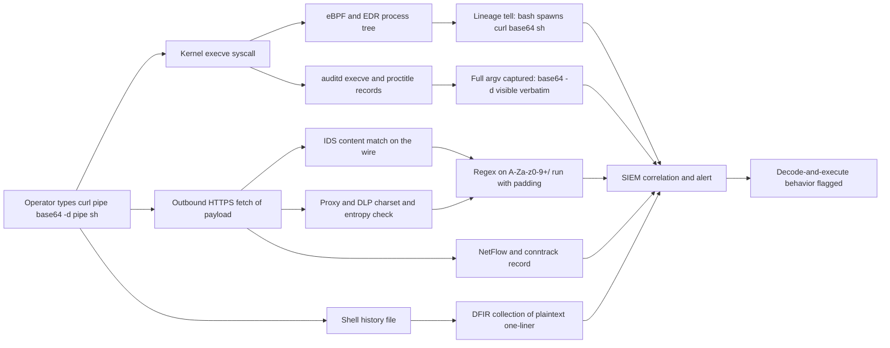
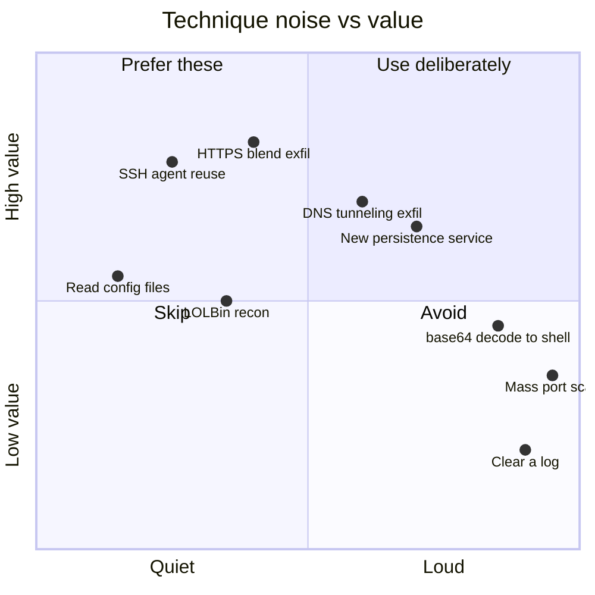
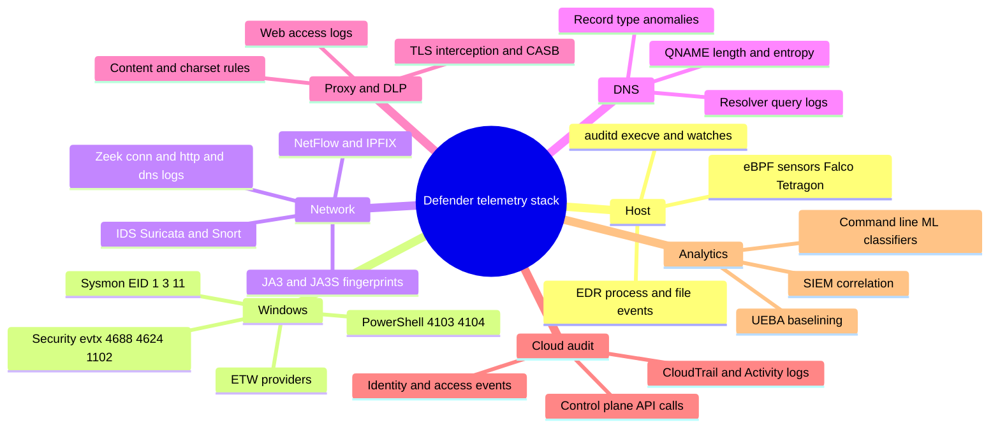
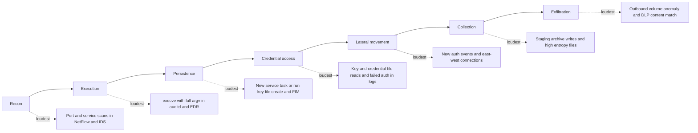

# Diagrams

_Visual companions to the Quiet Operator thesis: stealth is telemetry management. Every diagram below pairs an offensive decision with the defensive signal it generates. GitHub renders the fenced `mermaid` blocks inline. Use only lab/RFC-5737 examples in any derived work._

These charts are referenced throughout the repo. For the written models behind them see
[`00-foundations/operator-opsec-model.md`](00-foundations/operator-opsec-model.md),
[`00-foundations/threat-model-and-telemetry.md`](00-foundations/threat-model-and-telemetry.md),
and the blue-team index
[`detection-mapping/blue-team-view-and-attack-mapping.md`](detection-mapping/blue-team-view-and-attack-mapping.md).

---

## 1. Operator decision loop

Run this loop before every action. The point is to spend artifacts deliberately, not by accident. Full reasoning in [`00-foundations/operator-opsec-model.md`](00-foundations/operator-opsec-model.md).

---

## 2. Exfil channel selection decision tree

Pick the channel that blends with the environment baseline, not the one that is technically cleverest. See [`data-transfer/04-https-and-cloud-exfil.md`](data-transfer/04-https-and-cloud-exfil.md) and the data-transfer index.

---

## 3. Base64 decode-and-execute data flow with telemetry taps

The repo's worked example: encoding raises signal, it does not lower it. Each stage below is a place a defender already watches. Deep dive in [`detection-mapping/base64-and-encoding-telemetry.md`](detection-mapping/base64-and-encoding-telemetry.md).

---

## 4. Noise versus value quadrant

Representative techniques plotted by how loud they are against how much they advance the objective. Prefer the high-value, low-noise quadrant. Mapping discussion in [`00-foundations/operator-opsec-model.md`](00-foundations/operator-opsec-model.md).

---

## 5. Defender telemetry stack

The collection surface an operator is moving through. If you do not know which branch sees you, you are not stealthy. See [`00-foundations/threat-model-and-telemetry.md`](00-foundations/threat-model-and-telemetry.md).

---

## 6. Kill chain as telemetry-generating stages

Each stage emits a loudest signal. Knowing it tells you where to be quietest. Cross-mapped in [`detection-mapping/blue-team-view-and-attack-mapping.md`](detection-mapping/blue-team-view-and-attack-mapping.md).

---

## Reading these in context

Read each diagram against the page it links to. The charts are deliberately lossy summaries; the prose pages carry the exact event IDs, syscalls, field names, and hunt queries. For the canonical technique-to-detection table that underpins diagrams 5 and 6, start at
[`detection-mapping/blue-team-view-and-attack-mapping.md`](detection-mapping/blue-team-view-and-attack-mapping.md).
